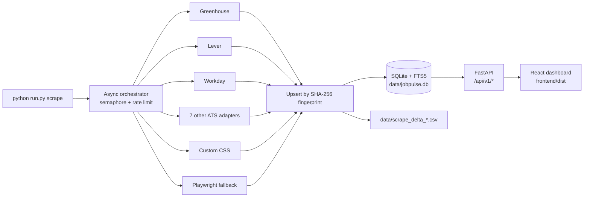

# JobPulse

> A **100% local**, single-machine job aggregator. Pulls openings from 200+
> company careers pages into one SQLite file and serves a fast, filterable
> dashboard with CSV export.
>
> **No Docker. No cloud. No background workers. No scheduler.** Scraping runs
> only when *you* run a command.

---

## Features

- 11 ATS adapters: Greenhouse, Lever, Workday, SmartRecruiters, Ashby, Workable,
  Recruitee, Personio, Teamtailor, plus a generic **CSS-selector custom**
  adapter and an opt-in **Playwright** fallback for JS-rendered pages.
- 219 pre-seeded companies.
- SQLite in WAL mode + **FTS5** full-text search.
- Stable per-job `fingerprint` → exact-once dedupe across runs.
- Delta CSV per run: `data/scrape_delta_<ts>.csv` (rows new this run only).
- FastAPI JSON API + streaming CSV export.
- React + Vite + Tailwind dashboard with filters, infinite scroll, job drawer,
  add-company wizard, and an admin/health view.
- Per-company manual rescrape from the UI.
- No telemetry, no outbound calls beyond the company sites you configure.

## Requirements

| | Version |
|---|---|
| Python | **3.13+** (3.12 likely works, untested) |
| Node | **20+** (only for building the dashboard) |
| OS | Windows / macOS / Linux |
| Disk | < 100 MB for code + dependencies; DB grows ~1 MB per 1000 jobs |

No Docker, no Redis, no Postgres, no message broker.

## 60-second quickstart

**Windows (one-liner bootstrap):**

```powershell
.\scripts\install.ps1            # installs uv, .venv, deps, migrates, seeds, builds UI
.\.venv\Scripts\Activate.ps1
python run.py scrape             # first scrape (1-5 min)
python run.py serve              # http://127.0.0.1:8000
```

Flags: `-SkipFrontend`, `-SkipPlaywright`.

**Manual / macOS / Linux:**

```bash
# 1. install uv (fast Python package manager) — see https://astral.sh/uv
curl -LsSf https://astral.sh/uv/install.sh | sh        # Windows: irm https://astral.sh/uv/install.ps1 | iex

# 2. venv + pinned deps from the lockfile
uv venv --python 3.13 .venv
source .venv/bin/activate                              # Windows: .\.venv\Scripts\Activate.ps1
uv pip sync requirements.lock

# 3. (optional) JS-rendered pages
playwright install chromium

# 4. database + seeds
python run.py migrate
python run.py seed

# 5. scrape (manual; takes 1-5 minutes the first time)
python run.py scrape

# 6. build the UI and serve
cd frontend && npm install && npm run build && cd ..
python run.py serve
# → open http://127.0.0.1:8000
```

> `requirements.lock` is the pinned, hash-verified lockfile (regenerate with
> `uv pip compile backend/requirements.txt -o requirements.lock --generate-hashes`).
> `backend/requirements.txt` lists the direct dependencies; the lockfile adds
> every transitive dep with a SHA-256 hash for reproducible installs.

Re-running step 4 anytime updates the DB and writes a delta CSV of new
postings. Refresh the dashboard to see them.

## Architecture



Every component is in-process and synchronous from the operator's perspective:
the CLI exits when the scrape finishes; the API process is a plain uvicorn
server that also serves the static dashboard bundle.

## Where the data lives

| Path | What |
|---|---|
| `data/jobpulse.db` | SQLite database (jobs, companies, scrape_runs, FTS5 index). |
| `data/jobpulse.db-wal`, `-shm` | WAL sidecar files — leave them alone. |
| `data/scrape_delta_<utc-ts>.csv` | New jobs from the most recent run. |
| `data/seed_check.csv` | Output of `python run.py check-seeds`. |
| `seeds/companies.json` | 219 starter companies. Hand-editable. |
| `frontend/dist/` | Built dashboard (created by `npm run build`). |

Delete `data/jobpulse.db*` to start over; rerun `migrate` + `seed`.

## CLI reference

| Command | What it does |
|---|---|
| `python run.py migrate` | Apply Alembic migrations. |
| `python run.py seed` | Insert/update companies from `seeds/companies.json`. |
| `python run.py scrape [--company NAME] [--ats TYPE] [--since YYYY-MM-DD] [--no-playwright]` | Manual scrape. |
| `python run.py add-company URL [--name X]` | Auto-detect ATS and register a company. |
| `python run.py detect-ats URL` | Print detected ATS family for a URL. |
| `python run.py check-seeds` | Probe every seeded company and write `data/seed_check.csv`. |
| `python run.py ingest-india [--from-goodfirms all] [--dry-run]` | Ingest India-based tech companies into the seed list (see below). |
| `python run.py infer-selectors [--playwright] [--dry-run]` | Auto-infer `custom_selectors` for custom-adapter companies that lack them (see below). |
| `python run.py serve [--host 127.0.0.1] [--port 8000]` | Run FastAPI + dashboard. |
| `python run.py reset --yes` | Drop schema and recreate. **Destructive.** |

## HTTP API (selected)

All endpoints are under `/api/v1`. Local-only by default; set `JOBPULSE_API_KEY`
to require an `X-API-Key` header on every mutating endpoint (POST/PATCH/DELETE).
The dashboard reads the key from `localStorage` (settable from the Admin page)
or from a `VITE_API_KEY` build-time env var.

| Method | Path | Notes |
|---|---|---|
| `GET` | `/jobs` | Filter + cursor-paginate jobs. Query params: `keywords` (repeat), `keyword_logic=and\|or`, `location`, `remote_only`, `company_ids` (repeat), `experience_min`, `experience_max`, `posted_within_days` (1-15 by default; widen via `JOBPULSE_POSTED_WITHIN_DAYS_MAX`), `sort=posted_date\|company\|title\|first_seen`, `cursor`, `limit` (≤200), `new_since` (ISO), `new_in_last_run`, `include_total`. Tokenizable keywords use FTS5; punctuation-bearing terms (`c++`, `.net`, multi-word phrases) fall back to LIKE automatically. |
| `GET` | `/jobs/export.csv` | Streaming CSV of the same filtered set. Accepts the same query params as `/jobs` (no `cursor` / `limit` — emits the full set). |
| `GET` | `/jobs/{id}` | Single job by id (404 if missing). |
| `GET` | `/companies` | List all companies. |
| `POST` | `/companies` | Create a company (single URL, with optional selectors for `custom`/`playwright`). Auth required. |
| `PATCH` | `/companies/{id}` | Update fields. Auth required. |
| `DELETE` | `/companies/{id}` | Remove company + cascade jobs. Auth required. |
| `POST` | `/companies/bulk-import` | Upload a CSV of companies (multipart `file`). Auth required. |
| `GET` | `/companies/detect?url=...` | Auto-detect ATS family. |
| `POST` | `/companies/{id}/scrape` | Queue an immediate per-company rescrape (in-process background task). Auth required. |
| `GET` | `/stats` | Totals + last scrape run. |
| `GET` | `/stats/companies` | Per-company health (active jobs, last success, failure streak). |
| `GET` | `/scrape-runs?limit=N` | Recent runs (newest first). |
| `POST` | `/scrape-runs` | Trigger a full scrape across all active companies. Returns 202 + `{status:"queued"}`; 409 if another run is in-flight (`finished_at IS NULL`). Optional `?ats=greenhouse` and `?no_playwright=true`. Auth required. |
| `GET` | `/health` | Liveness probe. |

## India-based tech companies

JobPulse ships with a tool to bulk-ingest India-based tech companies alongside
the default US/global seeds, so the same dashboard covers both markets.

```powershell
python run.py ingest-india --dry-run          # report only, writes nothing to seeds
python run.py ingest-india                     # Excel + curated list -> seeds
python run.py ingest-india --from-goodfirms all  # also live-scrape GoodFirms (needs Playwright)
python run.py seed                             # load the new companies into SQLite
python run.py scrape                           # scrape jobs
```

Sources (merged and de-duplicated by host):

1. The GoodFirms Excel export shipped in the repo
   (`dataset_goodfirms-*.xlsx`, ~576 companies).
2. A curated list of well-known Indian tech companies
   (`scripts/india_curated.json`).
3. Optional live GoodFirms directory scrape across several India categories
   (`--from-goodfirms python,java,ai,...` or `all`). GoodFirms sits behind
   Cloudflare and returns `403` to plain HTTP, so this path needs Playwright
   (`playwright install chromium`); it is skipped with a warning if Playwright
   is unavailable.

For each candidate the tool: strips `utm_*`/`ref` tracking params, scans the
homepage for a known ATS link (Greenhouse/Lever/Ashby/etc.), falls back to
probing `/careers`-style paths (registered as a `custom` adapter), and runs a
**5x HTTP sanity check** — any company that fails all five attempts is **dropped
entirely** and never written to the seed file. Survivors are appended to
`seeds/companies.json` tagged with `country: "India"`. Audit trails land in
`data/india_ingest_report.csv` (kept) and `data/india_ingest_dropped.csv`
(dropped, with reason).

**Filtering by country in the dashboard.** There is no separate country control;
the existing free-text **Location** filter is enough. Companies tagged with a
`country` have their scraped job locations normalized at scrape time — a job
listed as just `"Bangalore"` is stored as `"Bangalore, India"` (locations that
already name a country/region are left untouched). So typing `India` in the
Location box narrows the list to India-tagged companies. The `companies.country`
column is an internal signal only; it is not exposed as an API query parameter.

### Auto-inferring selectors for custom companies

Most India-based services companies have in-house careers pages rather than a
standard ATS, so `ingest-india` registers them as `ats_type="custom"` with **no**
selectors — they show up in the DB but return zero jobs until selectors are set.
`infer-selectors` bulk-configures them:

```powershell
python run.py infer-selectors --dry-run          # report only
python run.py infer-selectors                     # httpx pass over India custom companies
python run.py infer-selectors --playwright        # also try JS-rendered pages
python run.py seed                                # apply the new selectors to the DB
```

For each custom company it fetches the careers page and brute-forces a ranked
set of candidate CSS selectors, keeping the best `(list_item, title, apply_url)`
spec that the real extraction engine turns into at least two plausible job rows
(a `location` selector is added when it resolves for most rows). JS-heavy pages
matched only after a Playwright render are stored as `ats_type="playwright"` with
a `wait_for` hint. Results are written to `data/selectors_inferred.csv`;
companies where nothing could be inferred keep their current config and are
listed in `data/selectors_review.csv` for manual setup via the "Add company"
UI. This is heuristic — it configures the fraction of pages with a
machine-detectable structure, not all of them.

## Adding a custom adapter (per-company, no code)

Many career pages don't run on a standard ATS. Add them with the **custom**
adapter and three CSS selectors:

```bash
python run.py add-company https://example.com/careers --name Example
```

When `detect-ats` returns no match, the CLI (and the UI's "Add company"
modal) will ask for selectors:

```json
{
  "list_item": "ul.jobs > li",
  "title": ".job-title",
  "apply_url": "a.apply"
}
```

Optionally add `location`, `department`, `description`. If the page needs
JavaScript to render the list, choose `playwright` instead — same selector
schema, but rendered in a headless browser.

## Adding a new ATS family (code)

1. Create `backend/adapters/myats.py` and subclass `BaseAdapter`:
   ```python
   class MyATSAdapter(BaseAdapter):
       ats_type = "myats"
       async def fetch(self, company): ...     # raw payload via self.http
       def normalize(self, raw, company):       # yield NormalizedJob(...)
           ...
   ```
2. Register it in `backend/adapters/__init__.py`.
3. (Optional) Teach `backend/detect.py` to recognize the URL pattern.
4. Add a test in `tests/adapters/` using `respx` to mock HTTP.

## Caveats

- **Workday tenant identifiers are fragile.** Workday URLs encode a tenant and
  site key; if a company renames or rehosts, the seeded URL will 404. Re-add
  the company from the UI to refresh.
- **Playwright is opt-in.** It pulls ~150 MB of browsers. Skip
  `playwright install` if you don't need JS-rendered pages, and pass
  `--no-playwright` to scrape runs.
- **No scheduler.** Want hourly scrapes? Use Windows Task Scheduler or a cron
  entry that runs `python run.py scrape`. JobPulse will not do it for you.
- **Single-user app.** WAL handles UI reads during a scrape, but the dashboard
  and API are not intended for multi-user/network exposure. Bind to
  `127.0.0.1` (the default).
- **Respect robots.txt and ToS.** The scraper sends a descriptive `User-Agent`
  and backs off on 429s, but you are responsible for what you scrape.

## Project layout

```
backend/
  adapters/          # 11 ATS adapters + base
  alembic/           # migrations
  api/               # FastAPI routers (jobs, companies, stats, scrape_runs)
  db.py models.py    # SQLAlchemy + WAL pragmas
  scrape.py          # async orchestrator
  detect.py          # ATS auto-detection
  serve.py           # FastAPI app, mounts frontend/dist
frontend/
  src/               # React + TS + Tailwind dashboard
seeds/companies.json # 219 starter companies
data/                # runtime: DB, delta CSVs (gitignored)
tests/               # pytest suite (117 tests)
run.py               # Typer CLI entry point
```

## License

MIT. See [LICENSE](LICENSE).
